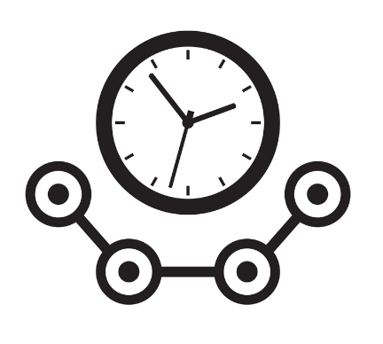
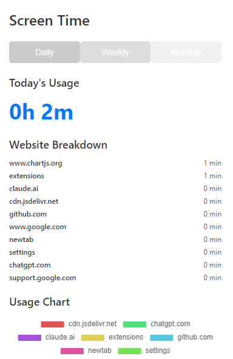
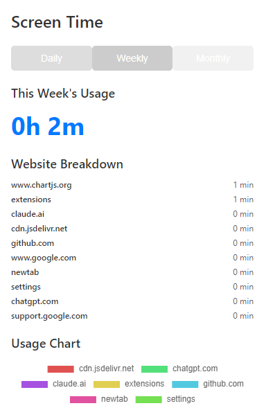
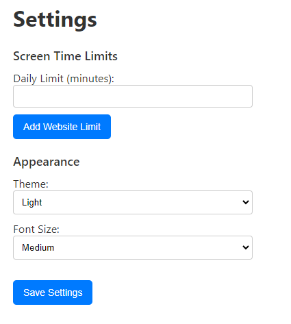
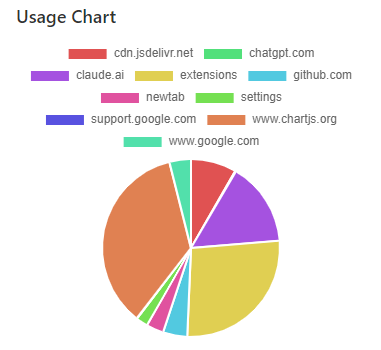

# Screen Time Tracker Chrome Extension

## Overview

Screen Time Tracker is a powerful Chrome extension designed to help you monitor and manage your online activities. With features similar to the iPhone's Screen Time, this extension provides comprehensive insights into your web browsing habits, helping you make informed decisions about your digital wellbeing.

*This extension is currently in development, so it might not work as intended. You are free to raise issues and offer solutions to them.*

## Features

- **Detailed Time Tracking**: Monitor time spent on each website visited.
- **Multi-timeframe Analytics**: View daily, weekly, and monthly usage statistics.
- **Interactive Charts**: Visualize your web usage with intuitive pie charts.
- **Customizable Limits**: Set daily or website-specific time limits.
- **Smart Notifications**: Receive alerts when you reach your set time limits.
- **Dark Mode Support**: Easy on the eyes, especially during night-time browsing.
- **Sync Across Devices**: Keep your data consistent across all your Chrome installations.

## Installation

1. Clone this repository or download the ZIP file.
2. Open Chrome and navigate to `chrome://extensions/`.
3. Enable "Developer mode" in the top right corner.
4. Click "Load unpacked" and select the extension directory.

## Usage

1. Click on the extension icon in your Chrome toolbar to view your current screen time statistics.
2. Navigate through daily, weekly, and monthly views using the tabs.
3. Access the settings page to customize time limits and appearance options.

## Screenshots

## Development

This extension is built using:

- HTML5
- CSS3
- JavaScript (ES6+)
- Chart.js for data visualization

To contribute:

1. Fork the repository
2. Create your feature branch (`git checkout -b feature/AmazingFeature`)
3. Commit your changes (`git commit -m 'Add some AmazingFeature'`)
4. Push to the branch (`git push origin feature/AmazingFeature`)
5. Open a Pull Request

<!-- ## License

Distributed under the MIT License. See `LICENSE` for more information. -->

## Contact

Project Link: [https://github.com/Rishikesh0523/screen-time-tracker](https://github.com/Rishikesh0523/screen-time-tracker)

## Acknowledgements

- [Chart.js](https://www.chartjs.org/)
- [Chrome Extensions Documentation](https://developer.chrome.com/docs/extensions/)
- [Font Awesome](https://fontawesome.com)
